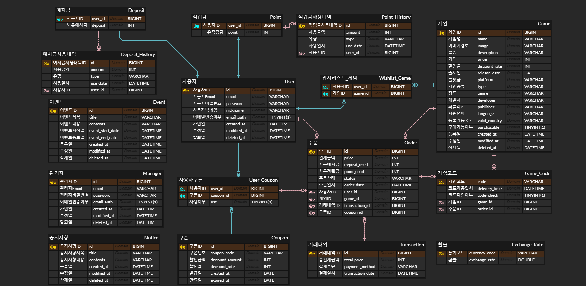

# 🎮 Game Collectors
다이렉트 게임즈, Humble Bundle과 같이 게임 등록 코드만 판매하는 ESD(전자 소프트웨어 유통망) 서비스입니다.

## 프로젝트 기능

- [x] 회원 가입
  - 사용자는 회원가입을 할 수 있다. 회원가입 시 User 권한을 가진다.
  - 관리자는 회원가입을 할 수 있다. 회원가입 시 Manager 권한을 가진다.
  - 회원가입시 이메일과 패스워드를 입력받는다. 이메일은 unique 해야한다
  - 사용자/관리자는 이메일 인증이 완료된 후 서비스를 이용할 수 있다.
  - 패스워드는 암호화되어서 저장된다.

- [x] 로그인 / 로그아웃
  - 사용자/관리자는 로그인을 할 수 있으며, 회원가입 시 입력한 이메일과 패스워드가 일치하여야 한다.
  - 로그인 시 1시간 동안 유효한 access 토큰과 2주간 유효한 refresh 토큰이 발급된다.
  - access토큰이 만료되었다면 refresh 토큰이 존재하는 경우 재발급이 가능하다.
  - 로그아웃 시 access 토큰이 blacklist에 등록되며, refresh 토큰은 db에서 삭제된다.

- [ ] 회원 정보 조회 / 수정
  - 사용자의 경우 예치금 및 적립금 조회가 가능하다.
  - 닉네임, 패스워드의 수정이 가능하다.
  - 패스워드 수정 시 수정 전 비밀번호를 입력하고 일치하여야 수정이 가능하다.

- [ ] 회원 탈퇴
  - 사용자/관리자는 회원 탈퇴를 할 수 있다. 
  - 탈퇴 후 6개월이 지난 회원정보는 삭제된다.

- [ ] 게임 검색
  - 로그인을 안하더라도 검색이 가능하다.
  - 게임명으로 검색이 가능하다.
  - 검색한 결과를 게임명, 가격, 출시일순으로 정렬이 가능하다.
  - 검색한 결과를 장르, 배급사, 플랫폼, 퍼블리셔, 게임종류(기본 게임, DLC, 번들)로 필터링이 가능하다.
  - 검색 시 나오는 정보는 게임명, 게임 이미지, 플랫폼, 정가, 할인된 가격, 할인율이다.
  - 페이징을 통해 한 페이지에 20개씩 표시된다.

- [ ] 게임 정보 조회
  - 로그인을 안하더라도 게임 정보 조회가 가능하다.
  - 게임 설명, 가격 등을 확인할 수 있다.
  - 설정한 국가의 계정에서 사용 가능한 게임인지 확인이 가능하다.
  - 설정한 통화로 게임가격이 얼마인지 표시된다.
  - 구매가능 여부도 표시된다.

- [ ] 게임 구매
  - 사용자는 게임 구매를 할 수 있으며 결제 수단을 고르고 결제할 수 있다.
  - 결제 시 예치금, 적립금, 쿠폰 사용이 가능하다.
  - 예치금/적립금은 단위는 원화이다.  
  - 쿠폰의 중복 사용은 불가능하다.
  - 쿠폰과 예치금/적립금을 같이 사용 시 쿠폰부터 적용이 된다.
  - 구매 완료 시 구매 금액의 1%가 적립금에 추가되며 100원 미만은 버린다.
  - 구매 완료 시 메일로 구매 정보가 전송된다.
  - 구매 불가 게임의 경우 구매할 수 없다.

- [ ] 구매 목록 조회
  - 사용자의 구매 완료가 완료되고 관리자에 의한 코드 제공이 완료되었다면 사용자는 코드 확인이 가능하다.
  - 구매 기간으로 조회가 가능하다.
  - 페이징을 통해 한 페이지에 20개씩 표시된다.

- [ ] 구매 취소
  - 사용자는 코드를 확인하지 않았고 코드 제공 후 7일 미만인 경우 구매 취소 및 환불이 가능하다.
  - 환불 시 예치금으로 환불을 원할 경우 예치금에 금액이 추가된다.
  - 사용한 예치금과 적립금은 복원되며 쿠폰은 복원되지 않는다.
  - 구매 후 얻은 적립금은 환불 금액에서 차감된다.

- [ ] 장바구니
  - 사용자는 구매하고 싶은 게임을 장바구니에 담을 수 있다.
  - 사용자는 장바구니를 조회할 수 있다.
  - 등록된 지 7일이 지난 게임은 목록에서 삭제된다.
  - 사용자는 장바구니에 들어있는 게임들을 1개 이상 골라서 삭제할 수 있다.
  - 사용자는 장바구니에 들어있는 게임을 1개 이상 골라서 구매할 수 있다.
  - 중복 등록이 불가능하다.
  - 장바구니에 등록되어 있는 상태에서 결제완료가 되었을 경우 해당 상품들은 장바구니에서 삭제된다.
  - 구매 불가 게임의 경우 장바구니 등록이 불가능하다.

- [ ] 위시리스트
  - 사용자는 나중에 구매하고 싶은 게임을 위시리스트에 담을 수 있다.
  - 사용자는 위시리스트를 조회할 수 있다.
  - 사용자는 위시리스트에 등록된 게임을 1개 이상 골라서 삭제할 수 있다.
  - 사용자는 위시리스트에 등록된 상품을 1개 이상 골라서 장바구니에 넣을 수 있다.
  - 중복 등록이 불가능하다.

- [ ] 예치금
  - 사용자는 보유 예치금을 조회할 수 있다.
  - 사용자는 예치금 사용 내역을 조회할 수 있다.

- [ ] 적립금
  - 사용자는 보유 적립금을 조회할 수 있다.
  - 사용자는 적립금 사용 내역을 조회할 수 있다.
  
- [ ] 쿠폰
  - 사용자는 제공된 쿠폰 코드를 입력해 쿠폰 등록을 할 수 있다.
  - 사용자는 이미 등록한 쿠폰과 같은 쿠폰을 등록할 수 없다.
  - 사용자는 본인이 등록한 쿠폰을 이용 가능 기간으로 조회가 가능하다.
  - 관리자는 쿠폰을 발급/조회/수정/삭제가 가능하다.
  - 쿠폰은 금액(원화)만큼 할인되는 쿠폰과 할인율만큼 할인되는 쿠폰 2종류가 있다.
  - 쿠폰은 쿠폰 번호와 할인금액/할인율, 만료일로 구성된다.
  - 쿠폰 번호는 16자리 숫자와 영문(대소문자 구분X)으로 구성된다.

- [ ] 게임 정보 관리
  - 관리자는 게임 정보를 등록/수정/삭제할 수 있다.

- [ ] 게임 코드 등록
  - 관리자는 게임 코드를 등록/조회/수정/삭제할 수 있다.
  - 조회 시 게임명으로 검색이 가능하다.

- [ ] 게임 코드 제공
  - 관리자는 사용자의 구매 완료 시 해당 사용자에게 코드 제공한다.
  - 예약 구매 게임의 경우 출시일 0시에 코드를 제공한다.
  - 코드 제공 완료 시 사용자에게 알림 메일을 전송한다.

- [ ] 공지사항
  - 로그인을 안하더라도 조회가 가능하다.
  - 페이징을 통해 한 페이지에 20개씩 표시된다.
  - 관리자는 공지사항을 등록/수정/삭제가 가능하다.
  - 공지사항은 제목과 내용으로 구성된다.

- [ ] 이벤트
  - 로그인을 안하더라도 조회가 가능하다.
  - 이벤트 페이지 접속 시 현재 진행중인 이벤트가 나온다
  - 페이징을 통해 한 페이지에 20개씩 표시된다.
  - 이벤트는 이벤트 기간으로 검색이 가능하며, 완료된 이벤트도 검색이 가능하다.
  - 관리자는 이벤트를 등록/수정/삭제가 가능하다.

- [ ] 환율 업데이트
  - 0시마다 환율이 최신 정보로 업데이트된다.
  - [한국수출입은행 현재환율 API](https://www.koreaexim.go.kr/ir/HPHKIR020M01?apino=2&viewtype=C&searchselect=&searchword=)를 이용한다.

### 추가로 구현할 기능
- [ ] 조회 API 캐싱
- [ ] 예치금 충전 / 출금

## ERD

## Tech Stack
- Java 11
- Spring 2.7.11
- SpringBoot
- Gradle
- MariaDB
- Redis
- Elastic Search
- H2
- Docker
- Git